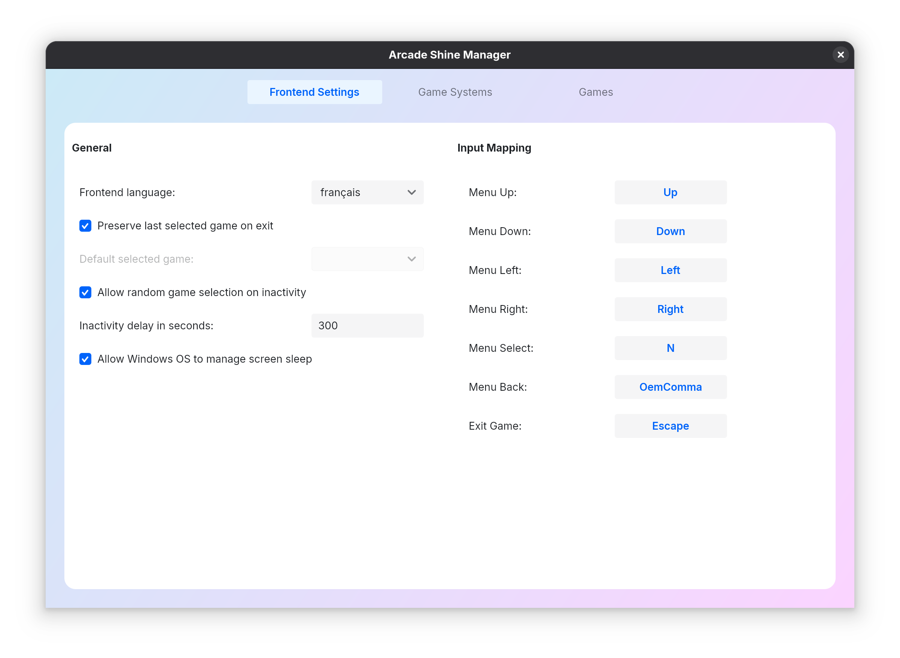

# Arcade Shine
 

This project is a software I developed for my own arcade cabinet. I decided to share my work under a GNU GPL v3 licence.

This project includes two main software, an arcade cabinet frontend and an arcade game library/launcher manager. The project aims to be compatible with any king of game systems (Native executable game or emulators). It works on Windows and Linux (Tested on Windows 11 and Fedora). In theory it can also runs on MacOS but I can't verify.

Arcade Shine frontend and Arcade Shine Manager are developped with [.NET 8](https://github.com/dotnet/sdk), [Avalonia UI](https://avaloniaui.net/) and [LibVLCSharp](https://code.videolan.org/videolan/LibVLCSharp)

## Screenshots

